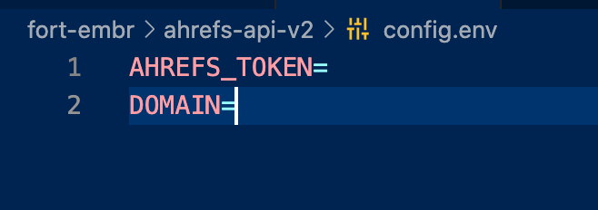

<!--
*** Thanks for checking out the Best-README-Template. If you have a suggestion
*** that would make this better, please fork the repo and create a pull request
*** or simply open an issue with the tag "enhancement".
*** Thanks again! Now go create something AMAZING! :D
***
***
***
*** To avoid retyping too much info. Do a search and replace for the following:
*** carbondigitalus, node-text-encoder, carbondigitalus, email, project_title, project_description
-->

<!-- PROJECT SHIELDS -->
<!--
*** I'm using markdown "reference style" links for readability.
*** Reference links are enclosed in brackets [ ] instead of parentheses ( ).
*** See the bottom of this document for the declaration of the reference variables
*** for contributors-url, forks-url, etc. This is an optional, concise syntax you may use.
*** https://www.markdownguide.org/basic-syntax/#reference-style-links
-->

<!-- [![Contributors][contributors-shield]][contributors-url]
[![Forks][forks-shield]][forks-url]
[![Stargazers][stars-shield]][stars-url]
[![Issues][issues-shield]][issues-url]
[![MIT License][license-shield]][license-url] -->

<!-- PROJECT LOGO -->
<br />
<p align="center">
  <a href="https://github.com/fortembr/ahrefs-api-v2">
    
  </a>

  <h3 align="center">Ahrefs API V2</h3>

  <p align="center">
    Using the Ahrefs API v2, with Node.js and saving the data locally in a JSON file.
    <br />
    *Note* The license for this repo only applies to the code present. You're still required to abibe by the rules and limitations set for by Ahrefs for their API. 
    <br />
    <a href="https://github.com/carbondigitalus/node-text-encoder"><strong>Explore the docs »</strong></a>
    <br />
    <br />
    <a href="https://github.com/carbondigitalus/node-text-encoder/issues">Report Bug</a>
    ·
    <a href="https://github.com/carbondigitalus/node-text-encoder/issues">Request Feature</a>
  </p>
</p>

<!-- TABLE OF CONTENTS -->
<details open="open">
  <summary><h2 style="display: inline-block">Table of Contents</h2></summary>
  <ol>
    <li>
      <a href="#about-the-project">About The Project</a>
      <ul>
        <li><a href="#built-with">Built With</a></li>
      </ul>
    </li>
    <li>
      <a href="#getting-started">Getting Started</a>
      <ul>
        <li><a href="#installation">Installation</a></li>
      </ul>
    </li>
    <li><a href="#usage">Usage</a></li>
    <li><a href="#contributing">Contributing</a></li>
    <li><a href="#license">License</a></li>
    <li><a href="#acknowledgements">Acknowledgements</a></li>
  </ol>
</details>

<!-- ABOUT THE PROJECT -->

## About The Project

This is a very simple project. We are taking the existing v2 API from Ahrefs, and plugging it into Node.js for internal use.

### Built With

- [Node](https://nodejs.org)
- [Typescript](http://typescript.com/)
- [Ahrefs API v2](https://app.ahrefs.com/api/)

<!-- GETTING STARTED -->

## Getting Started

To get a local copy up and running follow these simple steps. You should have Node.js and NPM installed on your computer at a minimum. You will need to have a basic understanding of how these tools operate in order to effectively manage the below tasks.

### Installation

1. Clone the repo
   ```sh
   git clone https://github.com/fortembr/ahrefs-api-v2.git
   ```
2. Install NPM packages
   ```sh
   npm install
   ```

<!-- USAGE EXAMPLES -->

## Usage

<p align="center">
  
</p>

1. In the config.env file, add your Ahrefs API Token, and the domain you want to check. Then save the file.
2. Run project.
   ```sh
   npm run start
   ```
3. Your JSON file is located in the results.json file and the console.

<!-- CONTRIBUTING -->

## Contributing

Contributions are what make the open source community such an amazing place to learn, inspire, and create. Any contributions you make are **greatly appreciated**.

1. Fork the Project
2. Create your Feature Branch (`git checkout -b feature/AmazingFeature`)
3. Commit your Changes (`git commit -m 'Add some AmazingFeature'`)
4. Push to the Branch (`git push origin feature/AmazingFeature`)
5. Open a Pull Request

<!-- LICENSE -->

## License

Distributed under the MIT License. See `LICENSE` for more information.
<br>
_Note_ The license for this repo only applies to the code present. You're still required to abibe by the rules and limitations set for by Ahrefs for their API.

<!-- ACKNOWLEDGEMENTS -->

## Acknowledgements

- [Jared L.](https://github.com/jared-leddy)

<!-- MARKDOWN LINKS & IMAGES -->
<!-- https://www.markdownguide.org/basic-syntax/#reference-style-links -->

[contributors-shield]: https://img.shields.io/github/contributors/fortembr/repo.svg?style=for-the-badge
[contributors-url]: https://github.com/fortembr/ahrefs-api-v2/graphs/contributors
[forks-shield]: https://img.shields.io/github/forks/fortembr/repo.svg?style=for-the-badge
[forks-url]: https://github.com/fortembr/ahrefs-api-v2/network/members
[stars-shield]: https://img.shields.io/github/stars/fortembr/repo.svg?style=for-the-badge
[stars-url]: https://github.com/fortembr/ahrefs-api-v2/stargazers
[issues-shield]: https://img.shields.io/github/issues/fortembr/repo.svg?style=for-the-badge
[issues-url]: https://github.com/fortembr/ahrefs-api-v2/issues
[license-shield]: https://img.shields.io/github/license/fortembr/repo.svg?style=for-the-badge
[license-url]: https://github.com/fortembr/ahrefs-api-v2/blob/main/LICENSE
[linkedin-shield]: https://img.shields.io/badge/-LinkedIn-black.svg?style=for-the-badge&logo=linkedin&colorB=555
[linkedin-url]: https://linkedin.com/in/carbondigitalus
