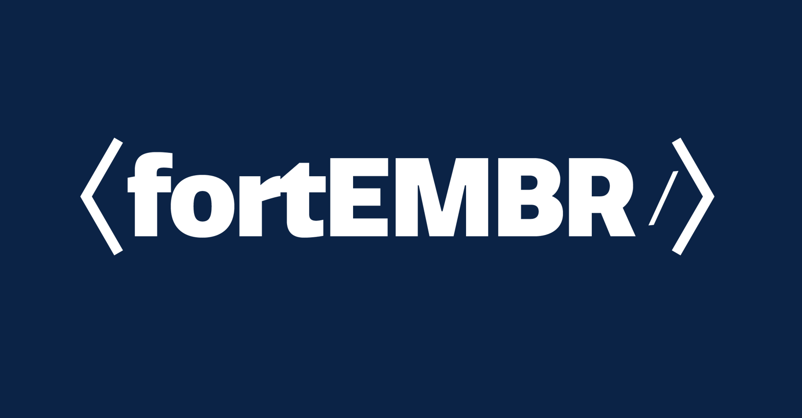

# ahrefs-api-v2

Using the Ahrefs API v2, and saving the data locally in a JSON file.

<!--
*** Thanks for checking out the Best-README-Template. If you have a suggestion
*** that would make this better, please fork the repo and create a pull request
*** or simply open an issue with the tag "enhancement".
*** Thanks again! Now go create something AMAZING! :D
***
***
***
*** To avoid retyping too much info. Do a search and replace for the following:
*** carbondigitalus, node-text-encoder, carbondigitalus, email, project_title, project_description
-->

<!-- PROJECT SHIELDS -->
<!--
*** I'm using markdown "reference style" links for readability.
*** Reference links are enclosed in brackets [ ] instead of parentheses ( ).
*** See the bottom of this document for the declaration of the reference variables
*** for contributors-url, forks-url, etc. This is an optional, concise syntax you may use.
*** https://www.markdownguide.org/basic-syntax/#reference-style-links
-->

[![Contributors][contributors-shield]][contributors-url]
[![Forks][forks-shield]][forks-url]
[![Stargazers][stars-shield]][stars-url]
[![Issues][issues-shield]][issues-url]
[![MIT License][license-shield]][license-url]

<!-- PROJECT LOGO -->
<br />
<p align="center">
  <a href="https://github.com/carbondigitalus/node-text-encoder">
    
  </a>

  <h3 align="center">Node Text Encoder</h3>

  <p align="center">
    Text encoder built for encoding email addresses, but useful for any simple conversions.
    <br />
    <a href="https://github.com/carbondigitalus/node-text-encoder"><strong>Explore the docs »</strong></a>
    <br />
    <br />
    <a href="https://github.com/carbondigitalus/node-text-encoder/issues">Report Bug</a>
    ·
    <a href="https://github.com/carbondigitalus/node-text-encoder/issues">Request Feature</a>
  </p>
</p>

<!-- TABLE OF CONTENTS -->
<details open="open">
  <summary><h2 style="display: inline-block">Table of Contents</h2></summary>
  <ol>
    <li>
      <a href="#about-the-project">About The Project</a>
      <ul>
        <li><a href="#built-with">Built With</a></li>
      </ul>
    </li>
    <li>
      <a href="#getting-started">Getting Started</a>
      <ul>
        <li><a href="#prerequisites">Prerequisites</a></li>
        <li><a href="#installation">Installation</a></li>
      </ul>
    </li>
    <li><a href="#usage">Usage</a></li>
    <li><a href="#roadmap">Roadmap</a></li>
    <li><a href="#contributing">Contributing</a></li>
    <li><a href="#license">License</a></li>
    <li><a href="#acknowledgements">Acknowledgements</a></li>
  </ol>
</details>

<!-- ABOUT THE PROJECT -->

## About The Project

This is a very simple string to HTML code conversion tool. This is a tool that we utilize for client websites to assist in masking their email address from spam bot crawlers. There aren't any guarantees that you'll be safe, but it helps to take extra precautions.

### Built With

- [Node](https://nodejs.org)
- [NPM](https://www.npmjs.com/)
- [NPM Package fast-text-encoding](https://www.npmjs.com/package/fast-text-encoding)

<!-- GETTING STARTED -->

## Getting Started

To get a local copy up and running follow these simple steps.

### Prerequisites

This is an example of how to list things you need to use the software and how to install them.

- npm
  ```sh
  npm install npm@latest -g
  ```

### Installation

1. Clone the repo
   ```sh
   git clone https://github.com/carbondigitalus/node-text-encoder.git
   ```
2. Install NPM packages
   ```sh
   npm install
   ```

<!-- USAGE EXAMPLES -->

## Usage

<p align="center">
  
</p>

1. For the variable, baseText, add your email address or text string to encode. Then save the file.
2. Run project.
   ```sh
   npm run start
   ```
3. Your encoded text is located in the results.txt file and the console.

If you need to, you can verify that your encoding is correct with [Text Fixer](https://www.textfixer.com/html/html-to-text.php).

<!-- ROADMAP -->

## Roadmap

See the [open issues](https://github.com/carbondigitalus/node-text-encoder/issues) for a list of proposed features (and known issues).

<!-- CONTRIBUTING -->

## Contributing

Contributions are what make the open source community such an amazing place to learn, inspire, and create. Any contributions you make are **greatly appreciated**.

1. Fork the Project
2. Create your Feature Branch (`git checkout -b feature/AmazingFeature`)
3. Commit your Changes (`git commit -m 'Add some AmazingFeature'`)
4. Push to the Branch (`git push origin feature/AmazingFeature`)
5. Open a Pull Request

<!-- LICENSE -->

## License

Distributed under the MIT License. See `LICENSE` for more information.

<!-- ACKNOWLEDGEMENTS -->

## Acknowledgements

- []()
- []()
- []()

<!-- MARKDOWN LINKS & IMAGES -->
<!-- https://www.markdownguide.org/basic-syntax/#reference-style-links -->

[contributors-shield]: https://img.shields.io/github/contributors/carbondigitalus/repo.svg?style=for-the-badge
[contributors-url]: https://github.com/carbondigitalus/node-text-encoder/graphs/contributors
[forks-shield]: https://img.shields.io/github/forks/carbondigitalus/repo.svg?style=for-the-badge
[forks-url]: https://github.com/carbondigitalus/node-text-encoder/network/members
[stars-shield]: https://img.shields.io/github/stars/carbondigitalus/repo.svg?style=for-the-badge
[stars-url]: https://github.com/carbondigitalus/node-text-encoder/stargazers
[issues-shield]: https://img.shields.io/github/issues/carbondigitalus/repo.svg?style=for-the-badge
[issues-url]: https://github.com/carbondigitalus/node-text-encoder/issues
[license-shield]: https://img.shields.io/github/license/carbondigitalus/repo.svg?style=for-the-badge
[license-url]: https://github.com/carbondigitalus/node-text-encoder/blob/master/LICENSE.txt
[linkedin-shield]: https://img.shields.io/badge/-LinkedIn-black.svg?style=for-the-badge&logo=linkedin&colorB=555
[linkedin-url]: https://linkedin.com/in/carbondigitalus
